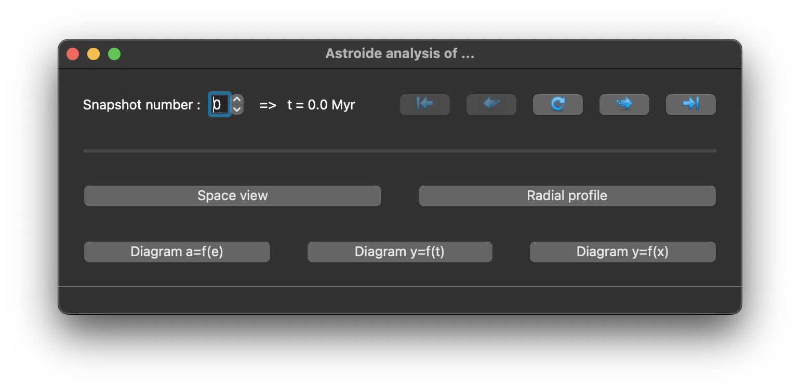

`Astroide` (Hervé Beust & Antoine Lacquement, 2025) is an open-source code for simulating planetary system dynamics, based on `SWIFT` (Hal Levison & Martin Duncan, 1994). It enables to simulate planetary systems that include debris disks composed of test particles. While these test particles do not affect the massive bodies, their own trajectories are influenced by the gravitational interactions with those bodies. The code also provides a graphical interface for analyzing simulation results.

  

# Table of contents

- [Installation on personal computeur](#install_on_computer)

- [Installation on computing server](#install_on_server)

- [Simulation](#simulation)
    - [Choice of integrator](#integrator)
    - [Generation of sub-simulations](#generation)
    - [Launch](#launch)
    - [Continuation](#continuation)
    - [Extraction](#extraction)

- [Analyse](#analyse)
    - [Space view](#space_view)
    - [Radial profile](#radial_profile)
    - [Diagram a=f(e)](#diagram_ae)
    - [Diagram y=f(t)](#diagram_yt)
    - [Diagram y=f(x)](#diagram_yx)
    

  

  

# Installation on personal computer

## Prerequisites

You need python3 and a fortran compiler, as gfortran.

## Create a container

It is recommended that you create a virtual environment. It is an isolated execution environment. It allows the packages used for a project to be isolated, so that there are different versions for each project.

To do this, use the following command: 

`python3 -m venv <environment_path>`

You can now activate the environment: 

`source <environment_path>/bin/activate`

The `python3` command will now refer to the python3 installed in your environment `<environment_path>/bin/python3` and not the one on the system. And the libraries are now installed in the `<environment_path>/lib/` directory.

If you do not choose this option, simply create an usual directory:

`mkdir <environment_path>`

## Download the github directory  

Now that the container is ready, you can download the gihub directory inside:

`cd <environment_path>`

`git clone https://github.com/lacquema/Astroide`

## Install python packages

All the necessary python packages are listed in the `<environment_path>/Astroide/requirements.txt` file. You can install them all:

`python3 -m <environment_path>/bin/pip install -r <environment_path>/Astroide/requirements.txt`

## Compile fortran code

If you are using the fortran compiler `gfortran`, you can directly compile all the fortran files:

`cd <environment_path>/Astroide`

`make compile`

Else, edit the `<environment_path>/Astroide/Makefile` file by updating the COMPILF variable. This corresponds to the paths or simply the command for the executables of the fortran compiler installed on your computer. Then, run the commands above. 

  

  

# Installation on computing server

You can import the code from github in the same way as on your personal computer. The difference lies in the installation of the software dependencies. 

On computing servers, the use of modern package managers such as Guix is highly recommended and often mandatory. These tools enable isolated and reproducible management of software dependencies, thus avoiding unintentional changes to the server environment. In addition, Guix avoids unnecessary duplication of packages by storing shared dependencies only once in the server's `/gnu/store`. This considerably reduces the use of storage space. 

Instead of installing packages directly, you configure them to reference the Guix-managed library. All required packages are explicitly listed in the `<environment_path>/Astroide/manifest.scm` file. You can reference them all:

`guix package -m <environment_path>/Astroide/manifest.scm`

Ensure to consult the Guix documentation provided by your server administrators, as specific configurations or permissions might apply.

Note that software dependencies may includes the python packages we need, as well as python3 itself and the fortran compiler `gfortran-toolchain`.

At this point, all that remains is to compile the fortran files in the same way as on a personal computer. 

  

  

# Simulation

  

## Choice of integrator

This code currently offers a choice of two integrators: RMVS3 and HJS, which differ in the way they calculate system dynamics.

RMVS3 uses heliocentric coordinates for each body. It is well suited to planetary systems in which the planets have negligible mass compared to the central star.

HJS, on the other hand, is based on Jacobi coordinates for each body in the system. It is more expensive in terms of computation time, but offers better accuracy than RMVS3. This integrator is particularly well suited to hierarchical multiple star systems.

  

## Generation of sub-simulations

To maximize computational efficiency, the simulation workload can be divided into multiple sub-simulations. The primary computational bottleneck is the large number of test particles, not the planetary dynamics. By distributing test particles among several independent sub-simulations, the code enables parallel execution, each sub-simulation can run concurrently, significantly reducing overall computation time.

After choosing your integrator, refer to both the example script (`gen_multi_rmvs3.sh` or `gen_multi_hjs.sh`) and its associated documentation file (`gen_multi_rmvs3.md` or `gen_multi_hjs.md`) in `<environment_path>/Astroide/Generators`. Use these resources together to understand all input parameters and their roles, then create or adapt your own script tailored to your simulation needs. The documentation provides detailed guidance to help you configure your script correctly.

The main difference between the two integrators is that, for `HJS`, you must also define the orbital hierarchy in Jacobi coordinates. This requires specifying, for each body, which other bodies are interior or dynamically independent. Properly setting this hierarchy is essential for accurate simulation results with the `HJS` integrator. 

Copy the relevant script into your working directory, edit its parameters to match your simulation setup, and execute the script to generate the sub-simulations.

The script will generate all necessary files for each sub-simulation (indexed by `i`). Once complete, each sub-simulation is fully configured and ready for execution.

  

## Launch

Once the sub-simulations are configured, you can start the computations by executing the `start_i.sh` files using the command that best fits your workflow.

For each sub-simulation, this process creates a `run_i` directory in the location you specified as `WORKPATH` in the generation script (`gen_multi_rmvs3.sh` or `gen_multi_hjs.sh`). All computations for that sub-simulation are performed within its respective directory.

To monitor the progress of the sub-simulations, you can run the `states.sh` script, which provides an overview of their current status.

  

## Continuation

Regardless of the reason for the interruption—such as time limits imposed on computing servers—you can resume a simulation from the latest checkpoint by simply running `continue_i.sh`. This script will automatically pick up the computation from where it left off, ensuring no progress is lost.

  

## Extraction

Once all sub-simulations have finished, you need to extract and consolidate the results. To do this, run the `mextract_multi.sh` script with up to three optional arguments: `t_0`, `t_f`, and `dt`, which specify the initial time, final time, and time step for extraction, respectively.

By default, `t_0` and `t_f` are set to the simulation's start and end times, and `dt` defaults to `0.1 * t_f`.

At each time step, the script generates a snapshot and writes it to the following files:
- `mextract.dat`: Contains the complete output data for all bodies and test particles.
- `followbodies.dat`: Contains output data for the massive bodies only.

These files provide a unified dataset from all sub-simulations, ready for further analysis.

  

  

# Analyse

You have access to a graphical interface for analyzing the results of your simulations. To launch it, run the following command:

`python3 <environment_path>/Astroide/Interface/Main.py`

After clicking the `Analyse` button, use the file browser on the left side of the interface to navigate and select the directory containing your simulation output files. You can double-click to choose the appropriate folder. If you have renamed your output files, you can enter their new names in the provided fields within the interface. Once everything is set, click `Analyse the simulation` to start the analysis process.

At the top of the window, a snapshot selector lets you choose the specific simulation time you wish to analyze. You can use this to navigate between different saved states of your simulation. The central refresh button updates the currently displayed plots to reflect your latest selection or any changes made to the analysis parameters.

The interface offers a comprehensive set of tools for exploring and visualizing your simulation results, each designed to support different aspects of your analysis. For every feature, you can access various options to customize and refine your study according to your specific needs. Descriptions and helpful tooltips appear when you hover over different elements of the interface, making it easier to understand and utilize each function effectively.

  

## Space view

This feature allows you to visualize the system in two or three dimensional space. You can display test particles either as individual points or as a density map using a histogram. This provides an intuitive overview of the spatial distribution and structure of both massive bodies and test particles within the simulation. 

  

## Radial profile

This feature allows you to visualize the distribution of particles as a function of distance from the center, integrated over angle. You can also overlay additional curves onto the radial profile by specifying a text file containing the curve data. The file should have two columns of equal length: the first column for the x-values (radii) and the second for the y-values (corresponding data points).

  

## Diagram a=f(e)

This feature allows you to plot the eccentricity versus the semi-major axis for each object in the system. This is particularly useful for identifying mean-motion resonances with massive bodies. An available option enables you to calculate and overlay the positions of various mean-motion resonances associated with the different massive bodies, providing deeper insight into the system's dynamical structure.

  

## Diagram y=f(t)
This feature allows you to plot the evolution of any orbital parameter (such as semi-major axis *a*, eccentricity *e*, inclination *i*, argument of periapsis $\omega$, longitude of ascending node $\Omega$, or mean anomaly *M*) as a function of time for any massive body in the system. This enables you to track and analyze the dynamical evolution of specific objects throughout the simulation.

  

## Diagram y=f(x)

This feature allows you to plot any mathematical expression involving the orbital parameters of different bodies as a function of another expression. To specify parameters, use *[k]*, where *k* is the orbit number of the body, counted from the center outward. You can also use standard mathematical functions within your expressions. This flexibility enables you to create custom plots tailored to your specific analysis needs.

